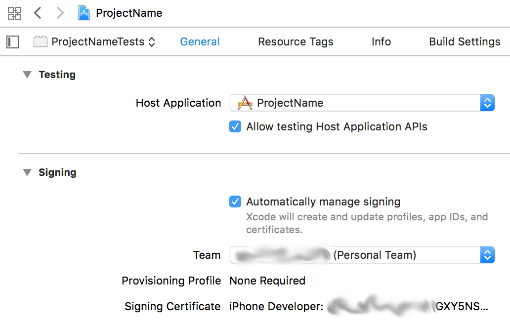

# react-native-ios-free-provisioning

Free provisioning for a React Native iOS application

## Preamble

[React Native](https://facebook.github.io/react-native/) is an amazing way to build once and deploy to both iOS and Android.

To test out the iOS version, you'd normally run the iOS Simulator on your Mac. But it would be really useful to see the app running on your iPhone &ndash; without having to [pay to join the Apple Developer Program](https://developer.apple.com/programs/how-it-works/).

So this repo describes how to set up free iOS provisioning on your iPhone for a React Native application.

## Prerequisites

- macOS High Sierra (10.13.x) or later
- Xcode 9.x
- `react-native-cli` globally installed:
    - `npm install -g react-native-cli`
- `yarn` via [Homebrew](https://brew.sh/):
    - if not installed: `brew install yarn`
    - if already installed: `brew update yarn`

These instructions have been been tested with `yarn` version `1.9.4`, but should work with earlier versions.

## Setup

If you don't already have a React Native project to work from, create one with your own `ProjectName`:

```sh
$ react-native init ProjectName
This will walk you through creating a new React Native project in /private/tmp/ProjectName
Using yarn v1.9.4
Installing react-native...
```

Then open the project in Xcode:

```sh
$ cd ProjectName
$ open ios/ProjectName.xcodeproj
```

## Add your iPhone to the device list

Plug your iPhone into your Mac with a USB cable.

In Xcode, navigate to **Window** > **Devices and Simulators**.

Click the **+** icon at bottom left of the dialog. Unlock your iPhone, and choose to trust your computer when prompted. On your iPhone, you will have to enter the iPhone's passcode.

It's also useful to check the **Connect via network** checkbox.

## Set the Destination to your iPhone

Navigate to **Product** > **Destination**.

Under **Device**, select your iPhone.

## Select the project


## Change the Bundle Identifier

Go to the **General** tab.

Under **Identity**, change the **Bundle Identifier** from `org.reactjs.native.example.ProjectName` to something unique, like your domain name.


So if your domain name is `example.com`, change the value to `com.example.ProjectName`.

## Manage signing for `ProjectName`

The **Signing** section will look like this:


Next to **Team**, click the **Add Account...** button, and sign in with your Apple ID when prompted.

Once you have signed in, go back to **Team** in the **Signing** section, and select **Your Name (Personal Team)**. If you have correctly set the Bundle Identifier in the previous step, the **Signing** section will now look like this:


## Manage signing for `ProjectNameTests`

Select the `ProjectNameTests` target:


Under the **Signing** section, next to **Team**, select **Your Name (Personal Team)**.



## Build and Run

Press the Play button at top left:


On first run, this will take a while.

Once built, you will see a modal dialog like this in Xcode:


Click **Ok**.

## Run on your iPhone

Unlock your iPhone. You will see the `ProjectName` app now installed on your iPhone. If you open it, you will receive a message like this:


So open the **Settings** app and navigate to **General** > **Device Management**, and select your developer app to trust it.

Now you can run `ProjectName` on your iPhone!

